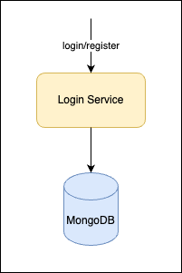

# Login

## Overview
This document outlines the design and development of a highly scalable login and user creation system for a mobile application. The system is engineered to handle a significant user base, specifically targeting 100,000 concurrent users.

## System Design

### User

| Field        | Type     | Description        | 
|:-------------|:---------|:-------------------| 
| _id          | ObjectID | ID of the user     | 
| userName     | string   | user name          |
| fullName     | string   | full name of user  |
| email        | string   | email of user      |
| phoneNumber  | string   | phone number       |
| hashPassword | string   | hashed password    |
| birthday     | string   | format: yyyy-mm-dd |
| createdDate  | string   | Time UTC +7        |

Index:
* email_idx (email): unique
* phone_idx (phoneNumber): unique
* username_idx (userName): unique

## API Spec

POST: /api/login

request

| Field    | Type   | Description          | 
|:---------|:-------|:---------------------| 
| account  | string | email/phone/username | 
| password | string | password             |

response

POST: /api/register

| Field    | Type   | Description          | 
|:---------|:-------|:---------------------| 
| account  | string | email/phone/username | 
| password | string | password             |

